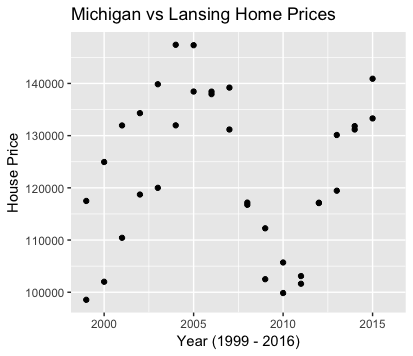

```{r setup, include=FALSE}
knitr::opts_chunk$set(echo = TRUE)
```

## Introduction

The aim of this report is to analyze the affect of the Flint water crisis on Median House Prices in Michigan. Specifically focusing on Michigan as a whole and the cities of Flint, Grand Rapids, Detroit, Ann Arbor, Kalamazoo and Lansing. These cities were chosen either for their size or their proximity to Flint, to assess how much of the state was affected by the crisis. 

******
## Flint Water Crisis 

In April of 2014, Flint, MI decided to switch from Detroit's water system and started drawing water from the Flint River. The change was considered temporary at the time, but the residents quickly notice the smell and the adverse health affects, including hair loss and rashes. In September of 2015, doctors and other state officials start testing the water in public schools and Gov. Rick Snyder soon announces that the state of Michigan will issue water filters to the residents of Flint. The Michigan Legislature and Snyder approve aid to Flint, including $6 million to switch the drinking water back to Detroit. In January of 2016, Snyder declares a state of emergency in Flint. Months later, after a lot of federal aid and help from the sourronding communities, the water quality starts to increase. In December of 2017, researchers state Flint is improving after finding no detectable levels of lead in over half of the homes. In March of 2017, water lines in 18,000 homes in Flint will be replaced, contributing to the clean water efforts. 

Although conditions are slowly improving, the real estate market in Flint and possibly other cities in Michigan have taken a severe hit from the water crisis. 

It is also worth noting that home prices in all of Michigan were heavily affected by the 2008 housing market crash and the data reflects this. 

******
## Map of Michigan 

Marked on this map is Flint in red, Detroit in blue, Ann Arbor in yellow, Lansing in purple, Kalamazoo in orange, and Grand Rapids in green. We can hypothesize that Detroit will be affected because of the proximity to Flint but Kalamazoo and other cities should not be.


******
## Median Home Prices

The following graphs show the trend of the median house prices in Michigan and the previously outlines cities. The Data was collected from Quandl, which receives the data from Zillow. The data available is from 1999 to 2016. 

### Michigan

The median home prices in Michigan start (in 1999) around $120,000 and stadily rise to around $148,000 in 2005. Then the prices start to decrease, which is consistent with the housing market crash. In 2010, the median home prices start to increase again and steadily increase from 2010 to 2016. 


### Flint, MI

The median price of homes in Flint, MI follows the same trend as Michigan overall until 2010, which is to be expected. After then, the median price starts to increase but, between 2010 and 2016, it never exceeds $40,000. At their peak, in 2005, the median price for homes was $70,000 so the decrease to under $40,000 is a significant decrease in prices in Flint. This can be attributed to the Flint water crisis because as quality of life in Flint decreased, so did the price of homes. 


### Grand Rapids, MI

As shown in the graph, housing price data was unavailable for Grand Rapids, MI between 1999 and 2011. For that reason, further analysis will not be done on Grand Rapids. However, as it is the second largest city in Michigan (by population), it is worth noting the effect the Flint water crisis had on prices. From 2012 on, median housing prices in Grand Rapids only increased, so we can see that it was not affected by the water crisis. 


### Detroit, MI

Detroit, because of it's close proximity to Flint, MI and it's role in the Flint water crisis, is the most likely city to be affected by the crisis. However, as shown on the graph, Detroit's median home prices only increased after 2014 and, from the graph, it appears that it was not affected by the water crisis. 


### Ann Arbor, MI

Ann Arbor is a unique city because it is home to University of Michigan. Because of the student population, housing is in such a high demand. The median home prices were affected by the 2008 housing market crash but rebounded quicker than other cities, most notably after 2010. Because of the high demand for property and the location, Ann Arbor was not at all affected by the Flint water crisis. 


### Kalamazoo, MI

Median home prices in Kalamazoo are the most consistent of the cities. Before the housing crisis, the median prices are between $80,000 to $100,000. They fall drastically in 2010, which is consistent with the rest of Michigan home prices, but they bounce back quickly in 2011 and go back to the median prices before the crash. As expected, Kalamazoo was not affected by the Flint water crisis. 


### Lansing, MI

Lansing, the capital of Michigan and home of the legislative building, was where important decisions about funding for the water crisis were made but the median home prices were not affected by the crisis. Like all other cities, the home prices were affected by the housing market crash but rebounded after 2010. 


## Michigan vs City Home Prices

Typically, cities within the state should follow the same housing price pattern. However, if some cities are more resiliant after a downfall, like the housing market crash, their housing price pattern will differ. Similarly, if the city has gone through something that is specific to that city, the housing price pattern should also differ. 

### Michigan vs Flint Home Prices

On the graph below, the top set of data points represents the median home prices in Michigan and the bottom set of data points represents the median home prices in Flint, MI. Is is apparant that while Flint was affected by the water crisis in 2014, the state of Michigan was not affected. 


### Michigan vs Detroit Home Prices

Again, the top set of data points represents the median prices of homes in Michigan and the bottom set of data points represents the median prices of homes in Detroit. This graph is more what you would expect as the pattern of housing prices in Detroit is close to the pattern of housing prices in Michigan. 


### Michigan vs Ann Arbor Home Prices

In this graph, Ann Arbor median home prices are represented by the top set of data points and the bottom set of data represents Michigan home prices. As shown, the data follow a similar pattern, decreasing after the 2008 housing market crash and increasing steadily after 2010. 


### Michigan vs Kalamazoo Home Prices

Between 1999 and 2016, Kalamazoo median home prices have stayed between about $80,000 and $100,000, only dipping in 2010. The data for Michigan is above the $110,000 median price. From this graph, we can see that at all times, the median housing prices in Kalamazoo is lower than the median for all of Michigan. 


### Michigan vs Lansing Home Prices

The data for Michigan and for Lansing is hard to differentiate because they follow the same pattern and they have similar median values. Lansing is an example of a city that represents the overall state data well. 



## T-Tests

The two sample t-test was used to compare the means of two groups, specifically the means of the home prices before the Flint water crisis and after. This test has been preformed for all cities and for Michigan as a whole. For each city, two new variables were created. 'City'b, which represents the average home prices before the water crisis and 'City'a, which represents the average home prices after the water crisis. With a significance level of .05, the p-value will be used to test if the difference in home prices is statistically significant. 

### Michigan

For Michigan, the t-test produced a p-value of .8013 and, at a significance level of .05, we can conclude that there is not a significant difference between the average home price in Michigan before and after the Flint water crisis. This is to be expected because the whole state was not affected by the water crisis. 

### Flint, MI

For Flint, the t-test produced a p-value of .002755 and, because this is less than .05, we can conclude that the differences in average home prices is statistically significant. This means the water crisis did have a negative affect on home prices in Flint, MI. 

### Detroit, MI

For Detroit, the t-test produced a p-value of .1423, which is greater than .05, so we can conclude that there is not a significant difference in average home prices in Detroit before and after the water crisis. Although Detroit is close to Flint, it makes sense that their home prices were not affected by the crisis. 

### Ann Arbor, MI

For Ann Arbor, the t-test produced a p-value of .2784, which is greater than .05, so we can conclude that there is not a significant difference in average home prices before and after the water crisis. Ann Arbor is far from Flint and, because of the University of Michigan, homes are always going to be in high demand so it would take something very serious to drastically lower home prices in Ann Arbor. 

### Kalamazoo, MI

For Kalamazoo, the t-test produced a p-value of .02149, which is less than .05, so the difference in average home prices is statistically significant. Although the timing is focused around the Flint water crisis, I do not believe the change in home prices in Kalamazoo was caused by this. Kalamazoo is too far from Flint to have been directly affected by the water crisis. 

### Lansing, MI

For Lansing, the t-test produced a p-value of .6039, which is greater than .05, so we can conclude that there is not a significant difference in average home prices before and after the water crisis. 

## Conclusion

The Flint water crisis plays a significant role in recent Michigan history. The reputation is the state has been affected by this crisis but no area has been more affected than Flint itself. This can be seen through the average home prices throughout Michigan. As shown on the graphs, Flint's housing prices were not able to rebound after 2014, while other cities have rebounded well after the 2008 housing market crash and continued to climb during the water crisis. The t-tests also conclude that Flint, MI was one of the only cities to have a significant difference of housing prices before and after 2014. Although Kalamazoo also showed a significant difference in home prices, I do not believe this was caused by the Flint water crisis. 

